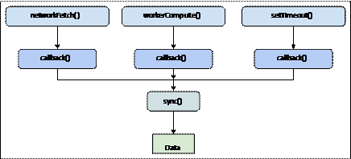
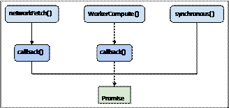
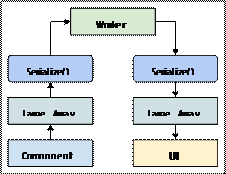
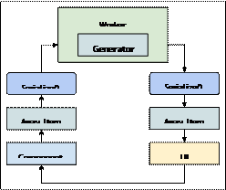
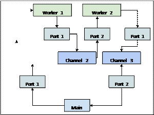
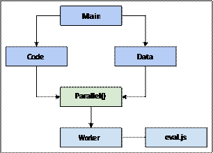

## 抽象并发

到本书这里，我们已经在代码中明确地模拟了并发问题。使用promises，我们同步化了两个或更多异步操作。

使用生成器，我们即时创建数据，避免不必要的内存分配。最后，我们了解到Web worker是利用多个CPU核心

的主要工具。


在本章中，我们将采用所有这些方法并将它们放入应用程序代码的上下文中。也就是说，如果并发是默认的，

那么我们需要使并发尽可能不那么明显。我们将首先探索各种技术，这些技术将帮助我们在使用的组件

中封装并发机制。然后，我们将通过使用promises来促进worker通信，直接改进前两章的代码。


一旦我们能够使用promises抽象worker通信，我们将尝试在生成器的帮助下实现惰性的worker。我们还将使用

Parallel.js库来介绍worker抽象，然后是worker线程池的概念。


### 编写并发代码

并发编程很难做到。即使是人为的示例应用程序，大部分复杂性来自并发代码。我们显然希望我们的代码可读，

同时保持并发的好处。我们希望充分利用系统上的每个CPU。我们只想在需要时计算我们需要的东西。我们不希望

意大利面条式的代码将多个异步操作纠缠在一起。在开发应用程序的同时关注并发编程的所有这些方面会削弱我们

应该关注的内容 - 提供应用程序价值的功能。


在本节中，我们将介绍可能用于将我们的应用程序的其余部分与棘手的并发隔离的方法。这通常意味着将并发

作为默认模式 - 即使在引擎下没有发生真正的并发时也是如此。最后，我们不希望我们的代码包含90％的

并发技巧和10％的功能。


#### 隐藏并发机制

在我们所有的代码中暴露并发机制的难度是，他们每一个都稍微不同于另一个。这扩大了我们可能已经发现

所在的回调地狱的情况。例如，不是所有的并发操作都是从一些远程资源获取数据的网络请求。异步数据

可能来自一个worker或一些本身就是异步的回调。想象一下场景我们使用了三个不同的数据源来计算一个

我们需要的值，所有的这些都是异步的。这里是这个问题的示图：




此图中的数据是我们在应用程序代码中关注的内容。从我们正在构建的功能的角度来看，我们并不关心上述

任何事情。因此，我们的前端架构需要封装与并发相关的复杂性。这意味着我们的每个组件都应该能够以

相同的方式访问数据。除了我们所有的异步数据源之外，还有另一个要考虑的复杂因素 - 当数据不是异步

的并且来自本地数据源呢？那么同步本地数据源和HTTP请求呢？我们将在下一节中介绍这些。


#### 没有并发性

仅仅因为我们正在编写并发JavaScript应用程序，并非每个操作本身都是并发的。例如，如果一个组件向另

一个组件询问它已经在内存中的数据，则它不是异步操作并会立即返回。我们的应用程序可能到处都是这些操作，

其中并发性根本就没有意义。其中存在的挑战 - 我们如何将异步操作与同步操作无缝混合？


简单的答案是我们在每处做出并发的默认假设。promise使这个问题易于处理。以下是使用promise来封装异步

和同步操作的示图说明：




这看起来很像前面的那个图，但有两个重要区别。我们添加了一个synchronous()操作; 这没有回调函数，因为

它不需要回调函数。它不是在等待其他任何东西，所以它会直接地返回。其他两个函数就像在上图中一样;

两者都依赖回调函数将数据提供给我们的应用程序。第二个重要区别是有一个promise对象。这取代了sync()操作

和数据概念。或者更确切地说，它将它们融合到同一个概念中。


这是promise的关键方面 - 它们为我们抽象同步问题的一般能力。这不仅适用于网络请求，还适用于Web worker

消息或依赖于回调的任何其他异步操作。它需要一些调整来考虑下我们的数据，因为我们得保证它最终会到达这里。

但是，一旦我们消除了这种心理差距，默认情况下就会启用并发性。就我们的功能而言，并发性是默认设置，而我们

在操作背后所做的事情并不是最具破坏性的。


现在让我们看一些代码。我们将创建两个函数：一个是异步的，另一个是简单返回值的普通函数。

这里的目标是使运行这些函数的代码相同，尽管生成值的方式有很大不同：

```javscript
//一个异步“fetch”函数。我们使用“setTimeout()”
//在1秒后通过“callback()”返回一些数据。
function fetchAsync(callback) {
	setTimeout(() => {
		callback({hello: 'world'});
	}, 1000);
}

//同步操作只简单地返回数据。
function fetchSync() {
	return {hello: 'world'};
}

//对“fetchAsync()”调用的promise。
//我们通过了“resolve”函数作为回调。
var asyncPromise = new Promise((resolve, reject) => {
	fetchAsync(resolve);
});

//对“fetchSync()”调用的promise。
//这个promise立即完成使用返回值。
var syncPromise = new Promise((resolve, reject) => {
	resolve(fetchSync());
});

//创建一个等待两个promise完成的promise。
//这让我们无缝混合同步和异步值
Promise.all([
	asyncPromise,
	syncPromise
	]).then((results) => {
		var [asyncResult, syncResult] = results;
		console.log('async', asyncResult);
		//→async {hello: 'world'}
	});

console.log('sync', syncResult);
//→sync {hello：'world'}
```

在这里的权衡是增加promise的复杂性，包裹它们而不是让简单的返回值函数马上返回。但在现实中，封装promise的

复杂性中，如果我们不是写一个并发应用，我们显然需要关心这类问题本身。这些的好处是巨大的。当一切都是

promise的值时，我们可以安全地排除令人讨厌的导致不一致的并发错误。


### worker与promise通信

我们现在已经知道了为什么将原始值视为promise有益于我们的代码。是时候将这个概念应用于web workers了。

在前两章中，我们的代码同步来自Web worker的响应看起来有点棘手。这是因为我们基本上试图模仿许多promise

善于处理的样板工作。我们首先尝试通过创建辅助函数来解决这些问题，这些函数为我们包装worker通信，

返回promise。然后我们将尝试另一种涉及在较低级别扩展Web worker界面的方法。最后，我们将介绍一些

涉及多个worker的更复杂的同步方案，例如上一章中的那些worker方案。


#### 辅助函数

如果我们能够以promise解决的形式获得Web worker响应，那将是理想的。但是，我们需要首先创造promise - 我们

该怎么做这个？好吧，我们可以手动创建promise，其中发送给worker的消息是从promise executor函数

中发送的。但是，如果我们采用这种方法，我们就不会比引入promise之前好多少了。


技巧是在单个辅助函数中封装发布到worker的消息和从worker接收的任何消息，如下所示：


我们来看一个实现这种模式的辅助函数示例。首先，我们需要一个执行某项任务的worker - 我们将从这开始：

```javascript
//吃掉一些CPU循环......
//源自http://adambom.github.io/parallel.js/
function work(n) {
	var i = 0;
	while (++i < n * n) {}
	return i;
}

//当我们收到消息时，我们会发布一条消息id，
//以及在“number”上执行“work()”的结果。
addEventListener('message', (e) => {
	postMessage({
		id: e.data.id,
		result: work(e.data.number)
	});
});
```

在这里，我们有一个worker，它会对我们传递的任何数字进行平方。这个work()函数特意很慢，以便我们可以

看到我们的应用程序作为一个整体在Web worker花费比平时更长的时间来完成任务时的表现。它还使用我们

在之前的Web worker示例中看到的id，因此它可以与发送消息的代码协调。让我们现在实现使用此worker

的辅助函数：

```javascript
//这将生成唯一ID。
//我们需要它们将Web worker执行的任务
//映射到更大的创建它们的操作。
function* genID() {
	var id = 0;
	while (true) {
		yield id++;
	}
}

//创建全局“id”生成器。
var id = genID();

//这个对象包含promises的解析器函数，
//当结果从worker那里返回时，我们通过id在这里查看。
var resolvers = {};

//开始我们的worker......
var worker = new Worker('worker.js');
worker.addEventListener('message', (e) => {

	//找到合适的解析器函数。
	var resolver = resolvers[e.data.id];

	//从“resolvers”对象中删除它。
	delete resolvers[e.data.id];
	
	//通过调用解析器函数将worker数据传递给promise
	resolver(e.data.result);
});

//这是我们的辅助函数。
//它处理向worker发送消息，
//并将promise绑定到worker的响应。
function square(number) {
	return new Promise((resolve, reject) => {
		//用于将Web worker响应和解析器函数绑定在一起的id。
		var msgId = id.next().value;

		//存储解析器以便以后在Web worker消息回调中可以使用。
		resolvers[msgId] = resolve;

		//发布消息 - id和number参数
		worker.postMessage({
			id: msgId,
			number: number
		});
	});
}

square(10).then((result) => {
	console.log('square(10)', result);
	//→square(10) 100
});

square(100).then((result) => {
	console.log('square(100)', result);
	//→square(100) 10000
});

square(1000).then((result) => {
	console.log('square(1000)', result);
	//→square(1000) 1000000
});
```

如果我们关注square()函数的使用方式，传递一个数字参数并将一个promise作为返回值，我们可以看到

这符合我们之前关于默认情况下使代码并发的讨论。例如，我们可以从这个场景中完全删除worker，只需

更改辅助函数解析它返回的promise的方式，我们的其余代码将继续保持不变。


辅助函数策略只是一种使用promises简化worker通信的方法。也许我们可以决定我们不一定要维护一堆辅助

函数。接下来，我们将看一个比辅助函数更细粒度的方法。


#### 扩展postMessage()

我们可以采用更通用的方法，而不是积聚大量辅助功能。辅助函数本身没有什么问题;他们是直接而且重要的。

如果我们达到了数百个这样的函数，它们的作用就会开始大打折扣了。更通用的方法是继续使用worker.postMessage()。


所以让我们看看是否可以使这个方法返回一个promise，就像我们上一节中的helper函数一样。这样，

我们继续使用细粒度postMessage()方法，但改进了我们的同步语义。首先，看看这里的worker代码：

```javascript
addEventListener('message', (e) => {

	//我们将发回主线程的结果，
	//它应该始终包含消息id。
	var result = {id: e.data.id};

	//基于“action”，计算响应值“value”。
	//选项是单独保留文本，
	//将其转换为大写，或将其转换为小写。
	if (e.data.action === 'echo') {
		result.value = e.data.value;
	} else if (e.data.action === 'upper') {
		result.value = e.data.value.toUpperCase();
	} else if (e.data.action === 'lower') {
		result.value = e.data.value.toLowerCase();
	}
});

//通过等待延时模拟一个运行时间很长的worker，
//它在1秒后返回结果
setTimeout(() => {
	postMessage(result);
}, 1000);
```

这与我们迄今为止在Web worker代码中看到的完全不同。现在，在主线程中，我们必须弄清楚如何改变Worker

的接口。我们现在就这样做。然后，我们将尝试向此worker发布一些消息并将处理promises作为响应：

```javascript
//这个对象包含promises的解析器函数，
//当结果从worker那里返回时，我们通过id在这里查看。
var resolvers = {};

//保持“postMessage()”的原始实现，
//所以我们可以稍后在我们的自定义“postMessage()”中调用它
var postMessage = Worker.prototype.postMessage;

//用我们的自定义实现替换“postMessage()”。
Worker.prototype.postMessage = function(data) {
	return new Promise((resolve, reject) => {

	//用于将Web worker响应和解析器函数绑定在一起的id。
	var msgId = id.next().value;

	//存储解析器以便以后可以在Web worker消息回调使用。
	resolvers[msgId] = resolve;

	//运行原始的“Worker.postMessage()”实现，
	//实际上负责将消息发布到worker线程。
	postMessage.call(this, Object.assign({
			id: msgId
		}, data));
	});
};

//开始我们的worker...
var worker = new Worker('worker.js');

worker.addEventListener('message', (e) => {

	//找到合适的解析器函数。
	var resolver = resolvers[e.data.id];

	//从“resolvers”对象中删除它。
	delete resolvers[e.data.id];
	
	//通过调用解析器函数将worker数据传递给promise
	resolver(e.data.value);
});

worker.postMessage({
	action: 'echo',
	value: 'Hello World'
}).then((value) => {
	console.log('echo', `"${value}"`);
	//→echo “Hello World”
});

worker.postMessage({
	action: 'upper',
	value: 'Hello World'
}).then((value) => {
	console.log('upper', `"${value}"`);
	//→upper “HELLO WORLD”
});

worker.postMessage({
	action: 'lower',
	value: 'Hello World'
}).then((value) => {
	console.log('lower'，`"${value}"`);
	//→lower “hello world”
});
```

嗯，这正是我们需要的，对吧？我们可以直接将消息数据发布给worker，并通过promise解析将响应数据发送

给我们。作为一个额外的好处，如果我们如此倾向，我们实际上可以围绕这个新的postMessage()函数实现

包装辅助函数。主要参与完成这项工作的技巧是存储对原始postMessage()的引用。然后，我们覆盖web worker

属性postMessage，而不是函数本身。最后，我们可以复用它并添加必要的协调来保证好用。


#### 同步worker结果

该代码在最后2段已经充分降低web workers回调地狱到可接受的水平。在事实上，现在我们已经有了一个方法处理

如何封装web workers通信由具有的postMessage()返回一个promise，我们准备要开始简化一些未使用这种方法的

混乱的worker代码。我们已经了解了这些例子的，所以到目前为止，已经从promise中获益良多，他们是简单的; 

没有这些抽象不会是世界末日。


那么我们映射数据集合然后映射和迭代集合的场景呢？我们可以回顾map reduce代码在“第6章，实用并行”。

这主要是由于所有worker通信模板代码与尝试执行map/reduce操作的代码纠缠在一起。让我们看看使用

promise技术是否更好。首先，我们将创建一个非常基本的worker：

```javascript
//返回一个输入数组的映射，
//它通过平方数组中的每个数字。
addEventListener('message', (e) => {
	postMessage({
		id: e.data.id,
		value: e.data.value.map(v => v * v)
	});
});
```

我们可以使用此worker传递数组进行映射。因此，我们将创建其中两个并在两个worker之间拆分工作负载，

如下所示：

```javascript
function onMessage(e) {

	//找到合适的解析器函数。
	var resolver = resolvers[e.data.id];

	//从“resolvers”对象中删除它。
	delete resolvers[e.data.id];

	//通过调用解析器函数将worker数据传递给promise
	resolver(e.data.value);
}

//开始我们的worker...
var worker1 = new Worker('worker.js'),
	worker2 = new Worker('worker.js');

//创建一些要处理的数据。
var array = new Array(50000).fill(null).map((v, i) => i);

//当worker返回数据时，找到适当的解析器函数来调用。
worker1.addEventListener('message', onMessage);
worker2.addEventListener('message', onMessage);

//将输入数据拆分为2，给出前半部分到第一个worker，
//给出后一部分到第二个worker。在这一点上，我们有两个promises。
var promise1 = worker1.postMessage({
	value: array.slice(0, Math.floor(array.length / 2))
});

var promise2 = worker2.postMessage({
	value: array.slice(Math.floor(array.length / 2))
});

//使用“Promise.all()”来同步workers
//比手动尝试协调整个worker回调函数要容易得多。
Promise.all([promise1, promise2]).then((values) => {
	console.log('reduced', [].concat(...values).reduce((r, v) => r + v));
	//→reduced 41665416675000
});
```

这就是我们需要向worker发布数据以及同步来自两个或更多worker的数据时，我们实际上就有动力编写并发

代码 - 它看起来与现在的其他应用程序代码相同。


### 惰性workers

现在是我们从不同角度看待web workers的时候了。我们使用worker的根本原​​因是我们想要在相同的时间内计算

比过去更多的数据。正如我们现在所知，这样做涉及消息传递错综复杂，可以说是分而治之的策略。我们必须通过将

数据输入和输出worker，通常使用数组。


生成器帮助我们实现惰性地计算。也就是说，我们不想在内存中计算内容或分配数据，直到我们确实需要它。

web workers难以实现这一目标吗？或者我们可以利用生成器来惰性地并行计算吗？


在本节中，我们将探讨有关在Web worker中使用生成器的方法。首先，我们将研究与Web worker相关的开销问题。

然后，我们将编写一些代码通过使用生成器来将数据输入或者输出worker。最后，我们将看看我们是否可以惰性地

通过一个生成器链传递数据，所有在web worker上的。


#### 减少开销

主线程可以拆分开销大的Web workers操作，在另一个线程中运行它们。这意味着DOM能够绘制挂起的更新并处理

挂起的用户事件。但是，我们仍然面临分配大型数组的开销和更新UI所需的时间。尽管与Web worker并行处理，

但我们的用户仍然可能面临运行缓慢，因为在处理完整个数据集之前，UI没有更新。这是通常模式的示图：




这是具有单个worker的数据所采用的通用路线; 当有多个worker时，同样的方法适用。使用这种方法，我们无法

避免需要将数据序列化两次这一事实，我们必须分配两次。这些开销仅仅是为了促进worker的通信，而与

我们试图实现的应用程序功能几乎没有关系。


worker通信所需的数组和序列化开销通常不是什么大问题。但是，对于更大的集合，我们可能会面临真正的

性能问题，这源于我们用于提高性能的机制。因此，从另一个角度看worker通信不会受到损失，即使最初没有必要。


这是大多数worker采用的通用路线的变体。不是预先分配和序列化大量数据，而是将单个项传入和传出worker。

这使得UI有机会在所有处理的数据到达之前使用已处理的数据进行更新。




#### 在workers中生成值

如果我们想要在workers生成结果时更新UI，那么他们无法将结果集打包为数组，以便在完成所有计算后发送

回主线程。当发生这种情况时，UI就停在那里而不响应用户。我们希望一个惰性的方法，其中值是在一段时间

产生一个，这样UI可以越快被更新。让我们建立一个例子，将输入发送到该web workers，然后将结果以一个

比我们之前在这本书已经看到的更细微的水平发送回来：


首先，我们将创造一个worker; 它的代码如下：

```javascript
//消耗一些CPU循环...
//源自http://adambom.github.io/parallel.js/
function work(n) {
	var i = 0;
	while(++i < n * n) {}
	return i;
}

//将调用“work()”的结果发回给主线程
addEventListener('message', (e) => {
	postMessage(work(e.data));
});
```

这里没有什么可大不了的。它与我们已经习惯的通过低效率地对数字进行减慢运行的代码的work()函数相同。

worker内部没有使用实际的生成器。这是因为我们真的不需要，我们马上就会明白为什么：

```javascript
//创建一个“update()”协程，
//在生成结果时持续更新UI。
var update = coroutine(function* () {
	var input;
	
	while (true) {
		input = yield;
		console.log('result', input.data);
	}
});

//创建worker，并指定“update()”协程
//作为“message”回调处理程序。
var worker = new Worker('worker.js');
worker.addEventListener('message', update);

//一个逐渐变大的数组
var array = new Array(10).fill(null).map((v, i) => i * 10000);

//迭代数组，将每个数字作为私有消息传递给worker。
for(let item of array) {
	worker.postMessage(item);
}
//→
//result 1
//result 100000000
//result 400000000
//result 900000000
//result 1600000000
//result 2500000000
//result 3600000000
//result 4900000000
//result 6400000000
//result 8100000000
```

传递给我们worker的每个数字的处理成本都比前一个数字要高。总的来说，在向用户显示任何内容之前处理整个输入

数组会觉得应用程序挂起或出错了。但是，这不是这种情况，因为虽然每个数字的处理开销很高，但我们会在结果

可用时将结果发布回来。


我们通过传入一个数组来执行和将数组作为输出返回来执行有着相同的工作量。然而，这种方法只是改变了事情发生的顺序。

我们在演示中引入了协作式多任务 - 在一个任务中计算一些数据并在另一个任务中更新UI。完成工作所花费的总时间

是相同的，但对于用户来说，感觉要快得多。总得说来，用户可感知的应用程序性能是唯一重要的性能指标。


> 我们将输入作为单独的消息传递。我们可以将输入作为数组传递，单独发布结果，并获得相同的效果。但是，这可能
> 仅仅是不必要的复杂性。对于模式有自然的对应关系，因为它是 - 项目输入，项目输出。如果你不需要就不要改变它。


#### 惰性worker链

正如我们在“第4章，使用Generator实现惰性计算”看到，我们可以组装生成器链。这就是我们惰性地实现复杂函数的

方式;一个项流经一系列生成器函数，这些函数在生成之前将项转换为下一个生成器，直到它到达调用者。没有生成器，

我们必须分配大量的中间数据结构，只是为了将数据从一个函数传递到下一个函数。


在本文之前的部分中，我们看到Web worker可以使用类似于生成器的模式。由于我们在这里面临类似的问题，我们

不希望分配大型数据结构。我们可以通过在更细粒度级别传递项目来避免这样做。这具有保持UI响应的额外好处，

因为我们能够在最后一个项目从worker到达之前更新它。鉴于我们可以与worker做很多事情，我们难道不能

基于在这个想法并组装更复杂的worker处理节点链吗？


例如，假设我们有一组数字和几个转换。我们在UI中显示这些转换之前，我们需要按特定顺序进行这些转换。

理想情况下，我们会设置一个worker链，每个worker负责执行其指定的转换，然后将输出传递给下一个worker。

最终，主线程获得一个可以在DOM中显示的值。


这个目标的问题在于它所涉及的很棘手的通信。由于专用worker只与创建它们的主线程进行通信，因此将结果发送

回主线程，然后发送到链中的下一个worker线程，这几乎没有什么益处。好吧，事实证明，专用worker可以直接通信

而不涉及主线程。我们可以在这里使用称为频道消息的东西。这个想法很简单; 它涉及创建一个频道，它有两个

端口 - 消息在一个端口上发布并在另一个端口上接收。


我们一直在使用消息传递频道和端口。他们被卷入web workers。这是消息事件和postMessage()方法模式的来源。

以下是我们如何使用频道和端口连接我们的Web worker的示图：




我们可以看到，每个频道使用两个消息传递端口。第一端口是用于发布消息，而所述第二端口被使用来接收消息事件。

主线程唯一一次使用是当所述处理链首先被用于发布一个消息给第一信道和当该消息从第三信道被接收到的消息。

不要让worker通信所需的六个端口吓倒我们，让我们写一些代码; 也许，那里看起来会更易于理解。首先，我们将创建

链中使用的worker。实际上，他们是同一个worker的两个实例。下面是代码：

```javascript
addEventListener('message', (e) => {

	//获取用于发送和接收消息的端口。
	var [port1, port2] = e.ports;

	//侦听第一个端口的传入消息。
	port1.addEventListener('message', (e) => {
		
		//在第二个端口上响应，结果为调用“work()”。
		port2.postMessage(work(e.data));
	});

	//启动两个端口。
	port1.start();
	port2.start();
});
```

这是很有趣的。在这个worker中，我们有消息端口可以使用。第一个端口用于接收输入，第二个端口用于发送输出。

该work()函数简单地使用我们现在熟悉的平方数浪费CPU周期来看workers如何表现。我们在主线程中想要

做的是创建这个worker的两个实例，这样我们就可以传递第一个平方数的实例。然后，在不将结果传递回

主线程的情况下，它将结果传递给下一个worker，并再次对数字进行平方。通信路线应该与前面的图表非常相似。

让我们看一下使用消息传递通道连接worker的一些代码：

```javascript
//开始我们的worker...
var worker1 = new Worker('worker.js');
var worker2 = new Worker('worker.js');

//创建通信所需的在两个worker之间的消息通道。
var channel1 = new MessageChannel();
var channel2 = new MessageChannel();
var channel3 = new MessageChannel();

//我们的“update()”协程会记录worker的响应
var update = coroutine(function* () {
	var input;
	
	while (true) {
		input = yield;
		console.log('result', input.data);
	}
});

//使用“worker1”连接“channel1”和“channel2”。
worker1.postMessage(null, [
	channel1.port2,
	channel2.port1
]);

//使用“worker2”连接“channel2”和“channel3”。
worker2.postMessage(null, [
	channel2.port2,
	channel3.port1
]);

//将我们的协程“update()”连接到收到“channel3”任何消息。
channel3.port2.addEventListener('message', update);
channel3.port2.start();

//我们的输入数据 - 一组数字。
var array = new array(25)
	.fill(null)
	.map((v, i) => i*10);

//将每个数组项发布到“channel1”。
for (let item of array) {
	channel1.port1.postMessage(item);
}
```

除了我们要发送给worker的数据之外，我们还可以发送一个消息端口列表，我们希望将这些消息端口传输

到worker上下文。这就是我们对发送给worker的前两条消息的处理方式。消息数据为空，因为我们没有

对它做任何事情。实际上，这些是我们发送的唯一消息直接给worker。通信的其余部分通过我们创建的消息

通道进行。开销大的计算发生在worker上，因为那是消息处理程序所在的位置。


### 使用Parallel.js

Parallel.js库的目的是为了使与Web worker交互尽可能的无缝。在事实上，它完成了这本书的一个关键目标，

它隐藏并发机制，并让我们能够专注于我们正在构建的应用程序。


在本节中，我们将介绍Parallel.js对worker通信采取的方法以及将代码传递给worker的通用方法。然后，

我们将介绍一些使用Parallel.js生成新worker线程的代码。最后，我们将探索这个库已经提供的内置

map/reduce功能。


#### 它怎么工作的

在本书中到目前为止我们使用的所有worker都是我们自己创造的。我们在worker中实现了消息事件处理，

计算某些值，然后发布响应。使用Parallel.js，我们不实现worker。相反，我们实现函数，然后将函数

传递给由库管理的workers。


这给我们带来了一些麻烦。我们所有的代码都在主线程中实现，这意味着更容易使用在主线程中实现的函数，

因为我们不需要使用importScripts()将它们导入到Web worker中。我们也不需要通过脚本目录

创建Web worker并手动启动它们。相反，我们让Parallel.js为我们生成新的worker，然后我们可以通过

将函数和数据传递给他们来告诉worker该做什么。那么，这究竟是如何工作的呢？


workers需要一个脚本参数。没有有效的脚本，worker根本无法工作。Parallel.js有一个简单的eval脚本。

这是传递给库创建的worker的内容。然后，主线程中的API将在worker中进行评估代码，并在需要与workers

通信时将其发送。


这是可行的，因为Parallel.js的目的不是暴露worker支持的大量功能。相反，目标是使worker通信机制

尽可能无缝，同时提供最小的功能。这样可以轻松构建与我们的应用程序相关的并发功能，而不是我们永远

不会使用的许多其他功能。


以下是我们如何使用Parallel.js和它的eval脚本将数据和代码传递给worker的说明：




#### 生成workers

Parallel.js库有一个作业的概念。作业的主要输入是作业要处理的数据。作业的创建并不直接与后台

worker的创建联系在一起。workers与Parallel.js中的作业不同;使用库时，我们不直接与worker

交互。一旦我们有了作业实例，并且它提供了我们的数据，我们就会使用一个作业方法来调用workers。


最基本的方法是spawn()，它将一个函数作为参数并在Web worker中运行它。我们传递给它一个函数作为

参数并且在web worker中运行。我们传递给它的函数可以返回结果，然后将它们解析为一个thenable对象

被spawn()函数返回。让我们看一下使用Parallel.js生成由一个web worker返回的新作业的代码：

```javascript
//一个数字输入数组。
var array = new Array(2500)
	.fill(null)
	.map((v, i) => i);

//创建一个新的并行作业。
//在这里没有worker的创建 - 
//我们只传递我们正在使用的构造数据。
var job = new Parallel(array);

//为我们的“spawn()”作业启动一个计时器。
console.time(`${array.length} items`);

//创建一个新的Web worker，并将我们的数据和这个函数传递给它。
//我们正在慢慢映射数组的每个数字到它的平方。
job.spawn((coll) => {
	return coll.map((n) => {
		var i = 0;
		while(++i < n*n) {}
		return i;
	});

	//“spawn()”的返回值是thenable。含义
	//我们可以分配一个“then()”回调函数，
	//就像返回的promise那样。
}).then((result) => {
	console.timeEnd(`${array.length} items`);
	//→2500 items：3408.078ms
});
```

那么现在，这很不错; 我们不必担心任何单调的Web worker生命周期任务。我们有一些数据和一些我们想要应用

于数据的函数，我们希望与页面上发生的其他作业并行运行。最吸引人的是熟悉的thenable，从那里返回的

spawn()方法。它适用于我们的并发应用程序，其中所有其他应用程序都被视为promise。


我们记录处理我们提供的输入数据的函数所需的时间。我们只为这个任务生成一个Web worker，因此在主线程中

计算得到的结果与原来的时间相同。除了释放主线程来处理DOM事件和重绘之外，没有实际的性能提升。我们将看看

是否可以使用一个不同的方法来提升并发级别。


> 当我们完成后，spawn()创建的worker立即终止。这为我们释放了内存。但是，没有并发级别来管理
> spawn()的使用，如果我们愿意，我们可以连续调用它100次。


#### Mapping and reducing

在上一节中，我们使用spawn()方法生成了一个worker线程。Parallel.js还有一个map()方法和一个

reduce()方法。这个方法是让事情变得更轻松。通过传递map()函数，库将自动将其应用于作业数据

中的每个项。类似的语义适用于reduce()方法。让我们通过编写一些代码来看看它是如何工作的：

```javascript
//一个数字输入数组。
var array = new Array(2500)
	.fill(null)
	.map((v, i) => i);

//创建一个新的并行作业。
//这里不会创建workers - 我们只传递我们正在使用的构造数据。
var job1 = new Parallel(array);

//为我们的“spawn()”作业启动一个计时器。
console.time('JOB1');

//这里的问题是Parallel.js会为每个数组元素创建一个新的worker，
//导致并行减速。
job1.map((n) => {
	var i = 0;
	while (++i < n*n) {}
	return i;
}).reduce((pair) => {
 
	//将数组项reduce为一个总和。
	return pair[0] + pair[1];
}).then((data) => {
	console.log('job1 reduced', data);
	//→job1 reduced 5205208751
	
	console.timeEnd('job1');
	//→job1：59443.863ms
});
```

哎哟! 这是一个非常重要的性能 - 这里发生了什么？我们在这里看到的是一种称为并行减速的现象。当并行

通信开销过多时，会发生这种减速。在这个特定示例中发生这种情况的原因是由于Parallel.js在map()中

处理数组的方式。每个数组项都通过一个worker。这并不意味着创建了2500个worker - 一个worker用于数组中

的每个元素。创建的worker数量最多只能达到4或者我们在本书前面看到的navigator.hardwareConcurrency值。


在真正的开销来自于发送的消息并收到了worker-5000个消息！这显然不是最优的，因为由代码中的定时器给证明。

让我们看看是否能够做出一个对这些数字的大幅改善，同时保持大致相同的代码结构：

```javascript
//更快的执行。
var job2 = new Parallel(array);

console.time('job2');

//在映射数组之前，将数组拆分为较小的数组块。
//这样，每个Parallel.js worker都是处理数组而不是数组项。
//这避免了发送数千个Web worker消息。
job2.spawn((data) => {
	var index = 0,
		size = 1000,
		results = [];

	while (true) {
		let chunk = data.slice(index, index + size);

		if (chunk.length) {
			results.push(chunk);
			index += size;
		} else {
			return result;
		}
	}
}).map((array) => {

	//返回数组块的映射。
	return array.map((n) => {
		var i = 0;
		while(++i < n * n) {}
		return i;
	});
}).reduce((pair) => {

	//将数组块或数字reduce为一个总和。
	return(Array.isArray(pair[0]) ? 
		pair[0].reduce((r, v) => r + v) :
		pair[0]) + (Array.isArray(pair[1]) ? 
		pair[1].reduce((r, v) => r + v) : 
		pair[1]);
}).then((data) => {

	console.log('job2 reduced', data);
	//→job2 resuced 5205208751
});

console.timeEnd('job2');
//→job2：2723.661ms
```

在这里，我们可以看到的是在同样的结果被产生，并且快得多。不同之处在于我们开始工作之前将数组切片成的阵列

较小的数组块。这些数组就是传递给workers的项，而不是单个的数。所以映射作业略微有好的改变，而平方一个数字，

它映射一个较小的数组到平方的数组。该reduce的逻辑是稍微复杂一些，但总体来说，我们的做法是仍然是相同的。

最重要的是，我们已经删除了大量的消息传递瓶颈，他们在第一次执行造成不可接受的性能缺陷。


> 就像spawn()方法在返回时清理worker一样，Parallel.js中的map()和reduce()方法也是如此。
> 释放worker的缺点是，无论何时调用这些方法，都需要重新创建它们。我们将在下一节讨论这个挑战。


### worker线程池

本章的最后一节介绍了worker线程池的概念。在上一节关于Parallel.js的介绍中，我们遇到了经常创建和终止

worker的问题。这需要很多开销。如果知道我们能够运行的并发级别，那么为什么不分配一个可以承担工作

的静态大小的worker线程池？


创建worker线程池的第一个设计任务是分配worker。下一步是通过将作业分发给池中的可用worker来计划作业。

最后，当所有worker都在运行时，我们需要考虑忙碌状态。我们开始吧。


#### 分配池

在考虑分配worker线程池之前，我们需要查看总体worker抽象池。我们如何希望它的外观和行为是怎样的？

理想情况下，我们希望抽象池的外观和行为类似于普通的专用worker。我们可以向线程池发布消息并获得promise

作为响应。因此，虽然我们无法直接扩展Worker原型，但我们可以创建一个与Worker API非常相似的新的抽象。


我们现在来看一些代码吧。这是我们将使用的初始抽象：

```javascript
//表示Web worker线程的“池”，
//隐藏在后面单个Web worker接口的接口。
function WorkerPool(script) {
	//并发级别，或者Web worker要创造的数量。
	//这使用了“hardwareConcurrency”属性(如果存在)。
	//否则，默认为4，
	//因为这是对最常见的CPU结构进行的合理猜测。
	var concurrency = navigator.hardwareConcurrency || 4;

	//worker实例本身存储在Map中，作为键。
	//我们马上就会明白为什么。
	var workers = this.workers = new Map();

	//对于发布的消息存在队列，所有worker都很忙。
	//所以这可能永远不会被用到的。
	var queue = this.queue = [];

	//用于下面创建worker程序实例，
	//以及添加事件监听器。
	var worker;
	for (var i = 0; i < concurrency; i++) {
		worker = new Worker(script);
		worker.addEventListener('message', function(e) {

			//我们使用“get()”方法来查找promise的“resolve()”函数。
			//该worker是关键。我们调用的从worker返回的数据的解析器
			//并且可以将其重置为null。
			//这个很重要，因为它表示worker是空闲的，
			//可以承担更多工作。
			workers.get(this)(e.data);
			workers.set(this, null);

			//如果有排队的数据，我们得到第一个
			//队列中的“data”和“resolver”。
			//我们用数据调用“postMessage()”之前，
			//我们使用新的“resolve()”函数更新“workers”映射。
			if (queue.length) {
				var [data, resolver] = queue.shift();
				workers.set(this, resolver);
				this.postMessage(data);
			}
			
			//这是worker的初始设置，作为在“worker”映射中的键。
			//它的值为null，意味着没有解析函数，它可以承担工作。
			this.workers.set(worker, null);
		}.bind(worker));
	}
}
```

创建新的WorkerPool时，给定的脚本用于生成线程池中的所有worker。该worker属性是一个Map实例，worker实例

本身是作为键。我们将worker存储为映射键的原因是我们可以轻松地查找适当的解析器函数来调用。


当给定的worker程序响应时，调用我们添加到每个worker的消息事件处理程序，这就是我们找的等待调用的解析器

函数的地方。我们不可能调用错误的解析器，因为给定的worker在完成当前任务之前不会接受新的工作。


#### 调度任务

现在我们将实现postMessage()方法。这是调用者用于将消息发布到池中的一个worker。调用者不知道哪个

worker满足了他们的要求，他们也不关心。他们将promise作为返回值，并以worker响应作为解析值：

```javascript
WorkerPool.prototype.postMessage = function(data) {

	//“workers”Map映射实例，其中包含所有存储的Web worker。
	var workers = this.workers;

	//当所有worker都很忙时消息被放在“queue”队列中
	var queue = this.queue;

	//尝试找一个可用的worker。
	var worker = this.getWorker();

	//promise会立即返回给调用者，
	//即使没有worker可用。
	return new Promise(function(resolve) {

		//如果找到了worker，我们可以更新Map映射，
		//使用worker作为键，并使用“resolve()”函数作为值。
		//如果没有worker，那么消息数据以及“resolve()”函数被推送到“queue”队列。
		if (worker) {
			workers.set(worker, resolve);
			worker.postMessage(data);
		} else {
			queue.push([data, resolve]);
		}
	});
};
```

它是promise执行器函数，实际负责查找第一个可用的worker并在那里发布我们的消息。当找到可用的worker

时，我们还在我们的worker映射中设置了worker的解析器函数。如果池中没有可用的worker程序，已

发布的消息则将进入队列。此队列在消息事件处理程序中清空。这是因为当worker返回消息时，这意味着

worker是空闲的可以承担更多工作，并且在返回空闲状态之前检查是否有任何worker排队。


该getWorker()方法是一个简单的辅助函数为我们查找下一个可用的worker。我们知道如果一个worker在

workers映射中将其解析器函数设置为null，则可以执行该任务。最后，让我们看看这个worker线程池的应用：

```javascript
//创建一个新的线程池和一个负载计数器。
var pool = new WorkerPool('worker.js');
var workload = 0;

document.getElementById('work').addEventListener('click', function(e) {

	//获取我们要传递给worker的数据，
	//并为此负载创建计时器。
	var amount = +document.getElementById('amount').value,
		timer = 'Workload' + (++workload);

	console.time(timer);

	//将消息传递给线程池，并在promise完成时，停止计时器。
	pool.postMessage(amount).then(function(result) {
		console.timeEnd(timer);
	});

	//如果消息开始排队，
	//我们的线程池就是过载并显示警告。
	if (pool.queue.length) {
		console.warn('worker pool is getting busy...');
	}
});
```

在这种使用场景中，我们有几个表单控件将参数化工作发送给worker。数字越大，工作时间越长; 它使用

标准的work()函数来缓慢地平方数字。如果我们使用大量数字并频繁单击按钮将消息发布到线程池中，

那么最终我们将耗尽线程池中可用的资源。如果是这种情况，我们将显示警告。但是，这仅用于故障排除，

当线程池繁忙时，发布的消息不会丢失，它们只是排队等候。


### 小结

本章的重点是从代码中删除突兀的并发语法。它只是提高了我们应用程序成功运行的可能性，因为我们将拥有

易于维护和构建的代码。我们解决的第一个问题是通过使所有内容都是并发的方式来编写并发代码。当没有

所涉及的猜测成分时，我们的代码就是一致的，不易受并发错误的影响。


然后，我们研究了抽象Web worker通信可以采取的各种方法。辅助函数是一个选项，因此扩展了postMessage()

方法。然后，当我们需要UI响应时，我们解决了Web workers的一些限制。即使我们的大型数据集处理速度更快，

我们仍然存在更新UI的问题。这是通过将Web worker作为生成器处理来完成的。


我们不必自己编写所有这些JavaScript并行化工具方法。我们花了一些时间来研究Parallel.js库的各种功能和限制。

我们以介绍Web worker线程池结束了本章。这些消除了与worker创建和终止相关的大量开销，并且它们极大地简化了

任务的分配和结果的协调。


这些都是适用于前端的并发话题。现在是时候切换一下，并使用NodeJS查看后端的JavaScript并发性。
