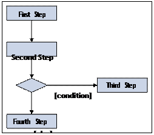
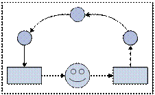
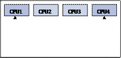
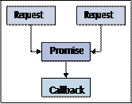
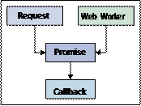

## 为什么需要JavaScript并发编程？ 

JavaScript并不是一门与并发相关的语言。事实上，它还与并发应用是完全不相符的。近几年来，这已经改变了很多，特别是ES2015新的的语言特性。Promise已经被用在JavaScript中好几年了; 只是现在，他们成为一种原生类型。 

Generator是另一种特性，改变了我们对JavaScript语言中并发的思考方式。web worker也已经被浏览器支持好几年了，然而，我们却并不常用。也许，是因为它与并发关系不大，而且更多地是关于对并发在我们的应用程序中扮演的角色的理解。 


本章的目的是探讨一些通用的并发思想，从准确的并发性开始。如果您在工作或学习中没有任何的并发编程经历，那很好，本章对您来说是一个很不错的起点。如果您以前使用JavaScript或其他语言完成过并发编程相关的项目，那可以将本章作为复习，仅使用JavaScript作为载体。 


我们将用一些总体并发原则来贯穿这一章。这些是有价值的编程工具，我们应该在编写并发代码时置于脑后。一旦我们学会应用这些原则，他们就会告诉我们我们的并发设计是否正确，或者需要

退后一步，问问自己真正想要实现的目标。这些原则采用自上而下的方法来设计我们的应用程序。这意味着它们从一开始就适用，甚至在我们开始编写任何代码之前。在整本书中，我们将引用这些原则，因此如果您只阅读本章的一节，那最好是并发原则那部分。                                                                                                                        


### 同步JavaScript 

在我们开始构建大规模并发JavaScript体系结构之前，让我们先将注意力转移到我们熟悉的、旧的同步JavaScript代码上。这些JavaScript代码块，它们作为单击事件的回调结果，或者作为加载网页的运行结果。一旦他们开始，他们就不会停止。也就是说，它们是一直运行到结束的。在接下来的章节中，我们将进一步深入研究他们。


> 我们在整个章节中偶尔会看到术语“同步”和“串行”，他们可互换使用。它们都是指代一个接一个地运行的代码语句，直到没有其他东西可以运行。


尽管JavaScript被设计为单线程，即时运行的，但Web的特性不得不使其复杂化。想想网络浏览器及其所有可应用的部件。有用于呈现用户界面的文档对象模型（DOM），有用于获取远程数据源的XMLHttpRequest（XHR）对象。让我们先来看看JavaScript的同步特性和Web的异步特性。


### 同步性很容易理解

当代码是同步的，它很容易被理解。将我们在屏幕上看到的指令集映射到头脑中的顺序步骤相当容易; 这样做，然后那样做; 判断一下，如果是，则执行此操作，依此类推。这种串行类型的代码处理很容易理解，因为没有任何特别的，假想代码的运行并不可怕。以下是我们如何可视化一大块同步代码的示例：



相反的，并​​发编程并不容易理解。这是因为我们的代码在编辑器并不能线性的去跟踪。相反，我们不断跳转，试图映射这段代码相对于那段代码所做的事情。时间是并行设计的重要因素; 这是违背大脑以自然方式来理解代码的东西。当我们阅读代码时，我们自然会在脑海中假想去执行它。这是我们弄清楚它在做什么的方式。


当代码实际执行不符合我们的想法时，这时就会很崩溃。通常情况下，看代码就像看一本书 - 而看并发代码就像一本书页面虽然被编号，但是不按顺序。我们来看看一些简单的伪JavaScript代码：

```javascript
var collection = ['a'，'b'，'c'，'d']; var results = [];

for（let item of collection）{results.push（String.fromCharCode（item.charCodeAt（0）））;

}

// ['b'，'c'，'d'，'e' ]
```

在传统的多线程环境中，线程与线程之间是异步运行。我们使用多线程来充分利用当今大多数系统中的多个CPU，从而获得更好的性能。但是，这需要付出代价的，因为它迫使我们去重新思考代码在运行时的执行方式。它不再是通常的一步一步的去执行。此代码可以与另一个CPU中的其他代码一起运行，也可以在同一CPU上与其他线程一起运行。


当我们将并发引入同步代码时，很多简单性就消失了 - 它是相当于脑冻结的代码。这就是我们编写并发代码的原因：代码提出并发的前期假设。随着本书的进展，我们将详细阐述这一概念。使用JavaScript，假设并发设计很重要，因为这就是Web的工作方式。


### 异步是不可避免的

JavaScript中的并发性是一个如此重要的想法，原因是Web是一个并发的地方，不管是从非常高的层次，还是实现细节水平上来说。换句话说，网络是并发的，因为在任何一个时间点，都有大量的数据流过数英里的光纤，这些光纤包围着全球。它与部署到Web浏览器的应用程序本身以及后端服务器如何处理一连串的数据请求有关。


### 异步浏览器

让我们仔细看看浏览器以及在那里发现的各种异步操作。当用户加载网页时，页面将执行的第一个操作就是下载和运行与页面一起JavaScript代码。这本身就是一个异步操作，因为在我们的代码下载时，浏览器将继续执行其他操作，例如呈现页面元素。


通过网络到达的另一个异步数据源是应用程序数据本身。加载页面并开始运行JavaScript代码后，我们需要为用户显示一些数据。这实际上是我们的代码将要做的第一件事，以便用户可以立即查看。同样，当我们等待这些数据到达时，JavaScript引擎会将我们的代码移动到它的下一组指令。这是对远程数据的请求，在继续执行代码之前不等待响应：


页面元素全部呈现并填充数据后，用户开始与我们的页面进行交互。这意味着事件被调度 - 单击元素将调度click事件。发送这些事件的DOM环境是一个沙盒环境。这意味着在浏览器中，DOM是一个子系统，与JavaScript解释器是分离的，后者运行我们的代码。这种分离使某些JavaScript并发方案特别困难。我们将在下一章深入介绍这些内容。


有了所有这些异步性的来源，毫无疑问，我们的页面会因特殊的情况处理而变得臃肿，以应对不可避免地出现的边缘情况。异步思考并不自然，因此这种类型的[/*猴子修补*/]可能是同步思考的结果。最好采用Web的异步特性。但是，同步网络可能会导致无法忍受的用户体验。

现在，让我们进一步了解我们在JavaScript体系结构中可能面临的并发类型。


### 并发的类型

JavaScript是一种运行时语言。尽管在运行上存在并发机制，但并没有解决它。换句话说，我们的JavaScript代码不会在if语句中间转而去控制另一个线程。这很重要的原因是我们可以选择一个有助于我们思考JavaScript并发的抽象层次。让我们看看在JavaScript代码中并发操作的两种类型。


### 异步操作

异步操作的一个特征定义是它们不会阻止其他后续操作。异步动作并不一定意味着“一劳永逸”。相反，当我们等待的操作部分完成时，我们运行一个回调函数。这个回调函数与我们的其余代码不同步; 因此，这被称为异步。


在Web前端中，这通常意味着从远程服务获取数据。这些请求操作相对较慢，因为它们必须通过网络连接。这些操作是异步的，这是因为我们的代码正在等待一些数据返回以便它可以触发回调函数，这并不意味着用户必须停下来等待。此外，用户当前正在查看的任何屏幕都不太可能仅依赖于一个远程资源。因此，串行处理多个远程提取请求会产生很不好的用户体验。


以下是异步代码的基本示例：

```javascript
var request = fetch（'/ foo'）;

request.addEventListener（（response）=> {

//现在已经到了“做出响应”的事情。

}）;

//不要等待响应，立即更新DOM。updateUI（）;
```

> 下载示例代码

> 您可以从http://www.packtpub.com上的帐户下载所购买的所有Packt Publishing书籍的示例代码文件。
> 如果您在其他地方购买了本书，可以访问http://www.packtpub.com/support并注册以直接通过电子邮件发送给您。


我们不仅限于获取远程数据，而是将其作为异步操作的一个案例。当我们发出网络请求时，这些异步控制流实际上会离开浏览器。但是，限制在浏览器中的异步操作呢？以setTimeout（）函数为例。它遵循与网络请求使用一样的回调模式。该函数已通过

回调，将在稍后执行。然而，没有任何东西离开浏览器。相反，该操作排在任何的其他操作后面。这是因为异步操作仍然只是一个控制线程，由一个CPU执行。这意味着随着我们的应用程序在规模和复杂性方面的增长，我们就会面临并发扩展问题。但是，也许异步操作并不意味着只是解决单一CPU问题。


考虑在单个CPU上执行异步操作的更好方法可能是想象一下杂技师抛球的场景。杂技师的大脑是CPU，协调他的动作。被抛出的球是我们操作的数据。我们关心的只有两个基本行动 - 抛球和接球：





由于杂技师只有一个大脑，所以他不可能将自己的精力用于一次执行多项任务。然而，杂技师经验丰富，并且知道他不需要分出一小部分精力用于投掷或捕捉动作。一旦球在空中，他可以自由地将注意力转移到接近即将降落的球上。


别人在看这个杂技师的动作时，他似乎全神贯注于所有抛出的六个球，而实际上，他在同一个时间点会忽视其他五个在空中的球。


### 并行操作

与异步性一样，并行性允许控制流继续而无需等待操作完成。与异步性不同，并行性要取决于硬件。这是因为我们不能在单个CPU上并行的进行两个或更多个控制流程。然而，除了异步性之外，设置并行性的主要方面是使用它的基本原理。这两种并发方式解决了不同的问题，并且需要不同的设计原则。


有时，我们希望并行执行操作，否则如果同步执行则会耗费时间。想想正在等待完成三项复杂操作的用户。如果每个操作都需要10秒钟才能完成，那么这意味着用户必须等待30秒。如果我们能够并行执行这些任务，我们可以使得总等待时间接近10秒。我们以更少的成本获得更多，从而实现高效的用户交互体验。


这些都不是免费的。与异步操作一样，并行操作会将回调作为通信机制。通常，设计并行性很难，因为除了与工作线程进行通信之外，我们还要担心手头的任务，也就是说，我们希望通过使用工作线程来实现什么？我们如何将问题分解为更小的操作？以下是我们开始引入并行性代码时的大致示例：

```javascript
var worker = new Worker（'worker.js'）;

var myElement = document.getElementById（'myElement'）;

worker.addEventListener（'message'，（e）=> {
	
	myElement.textContent ='完成工作！';

}）;

myElement.addEventListener（'click'，（e）=> {
	
	worker.postMessage（'work'）;

}）;
```

不要担心这段代码运行时的机制，因为它们将在后面深入讨论。需要注意的是，当我们将一些线程放入工作环境时，我们会向已经被污染的环境添加更多回调。这就是为什么我们需要并发设计在我们的代码，这是本书的主要话题，从第5章开始，我们在工作环境中使用线程。


让我们考虑下前一节中的杂技师类比。抛掷和捕获动作由杂技师异步执行; 也就是说，他只有一个脑（CPU）。但是假设我们周围的环境在不断变化。我们的杂耍行为越来越多，一个杂技师不可能让他们全部完成：
                                                                                                                          


解决方案是为该表演中加入更多的杂技师。通过这种方式，我们可以添加更多的计算能力，在同一时刻执行多次抛掷和捕获操作。对于一个异步运行的单个杂技师来说，这是不可能的。


我们还没有走出困境，因为我们不能只让新添加的杂技师站在一个地方，并按照一个杂技师玩杂耍的方式执行他们的行为。观众很多，更多样化，都需要被逗乐。杂技师需要能够有不同的动作。他们需要在地板上不断的四处移动

以让每一个观众都能感觉开心。他们甚至可能开始互相玩杂技。由我们来做一个能够策划这种杂耍行为的设计。


### JavaScript并发原则：并行化，同步，存储

既然我们已经了解了并发性的基础知识，以及它在前端Web开发中的作用，那么让我们看一下JavaScript开发的一些基本并发原则。这些原则仅仅是我们在编写并发JavaScript代码时为我们的设计选择提供信息的工具。


当我们应用这些原则时，它们迫使我们退后一步，在我们推进实施之前提出适当的问题。特别的，是关于为什么和如何做的问题：


• 我们为什么要实现这种并发设计？

• 我们希望从中获得什么，否则我们无法摆脱简单的同步方法？

• 我们如何应对应用程序功能不显眼的方式实现并发？


这是每个并发原则的参考图，在开发过程中相互依赖。有了这个，我们将把注意力转向每个原则，以便进一步探索：


### 并行化

并行化原则意味着利用现代CPU功能在更短的时间内计算结果。现在可以在任何现代浏览器或NodeJS环境中使用。在浏览器中，我们可以使用Web worker实现真正的并行性。

在NodeJS中，我们可以通过生成新进程来实现真正的并行性。从浏览器的角度来看，下图这就是CPU的样子：




由于目标是在更短的时间内进行更多的计算，我们现在必须问自己为什么要这样做？除了原始性能本身非常酷的事实之外，还必须对用户产生一些切实的影响。这个原则让我们看着我们的并行代码并询问 - 用户从中获得了什么？答案是我们可以使用较大的数据集作为输入进行计算，并且很少可能由于JavaScript长时间运行，带来无响应的用户体验。


重要的是仔细检查并行的实际好处，因为当我们这样做时，我们会增加代码的复杂性，否则就没多大意义了。因此，如果用户看到相同的结果，得到同样的体验，那无论我们做什么，并行化原则可能都不适用。另一方面，如果可伸缩性很重要且数据集大小增加的可能性很大，那么并行性的代码简单性的折衷可能是值得的。在考虑并行化原则时，这里有一个要遵循的检查列表：


• 我们的应用程序是否针对大型数据集执行需要很高昂的计算成本？

• 由于我们的数据集增长的大小，是有能力处理瓶颈，不让对用户产生负面影响的？

• 我们的用户目前是否在应用程序性能方面遇到瓶颈？

• 考虑到其他限制因素，我们的设计中的并行性有多大可行性？有什么权衡取舍？

• 从用户感知延迟或代码可维护性方面来看，并发实现的好处是否超过了开销成本？

 
### 同步

同步原则是有关以协调并发操作和抽象的一些机制。回调函数是一个具有深远根源的JavaScript概念。这是个明显的方式选择，当我们需要运行一些代码，但我们不希望马上就运行它。我们希望当一些条件符合再运行它。往大的方面讲，这种方式没有什么内在的错误。/*用在隔离的回调格局是可能的最简洁，可读性并发这种模式，我们可以使用*/。在大量使用回调，并且在回调之间存在有大量的依赖时，我们是很崩溃的。


### Promise API

Promise API是ECMAScript 6中引入的核心JavaScript语法，用于解决当前每个应用程序所面临的同步问题。这是一个在实际使用回调时更简单的API（是的，我们正在与嵌套回调做斗争）。Promise的目的不是要消除回调，而是要移除不必要的回调。以下是用于同步两个网络请求调用的Promise示例：

 


Promise的关键在于它们是一种通用的同步机制。这意味着它们不是专门针对网络请求，Web workers或DOM事件而产生的。我们程序员必须使用promises包装我们的异步操作，并在必要时解决它们。这是一件好事的原因是因为依赖promise接口的调用者并不关心promise中的内容。顾名思义，Promise是在某个时刻完成的。这可能需要是5秒或更快。数据可以来自网络资源或Web用户。调用者并不关心，因为它假设并发，这意味着我们可以在不破坏应用程序的情况下以任何方式实现它。这是上图的修改版本，它将为我们提供尝试实现承诺的可能性：




当我们学会在将来的某个时刻将值视为值时，并发代码突然变得更加易于理解了。Promise和类似的机制可用于同步网络请求，或仅仅是Web用户的事件。

但他们真正有能力使用它们来编写并发应用程序，其中并发是默认的。在考虑同步原则时，这里有一个参考清单：


• 我们的应用程序是否严重依赖回调函数作为同步机制？

• 我们是否经常需要同步多个异步事件，例如网络请求？

• 我们的回调函数是否包含比应用程序代码更多的同步重复代码？

• 我们的代码对驱动异步事件的并发机制做了哪些假设？

• 如果我们有一个问题导致并发失败，我们的应用程序是否仍然按预期运行？

 
### 存储

存储原则是关于节省计算和内存资源。这是通过使用惰性评估技术完成的。惰性的名称源于我们在确定我们确实需要它之前不会实际计算新值的想法。

想象一下呈现页面元素的应用程序组件。我们可以传递此组件它需要呈现的确切数据。这意味着在组件实际需要之前会进行多次计算。它还意味着所使用的数据

需要分配到内存中，以便我们可以将它传递给组件。这种方法并没有错。实际上，它是在JavaScript组件中传递数据的标准方法。


替代方法使用延迟评估来实现相同的结果。不是计算要渲染的值，而是在要传递的结构中分配它们，我们计算一个项目，然后渲染它。将此视为一种合作的多任务，

其中较大的动作被分解为较小的任务，来回传递控制的焦点。


这是一种快速的计算数据方法，并将其传递给呈现UI元素的组件：


这种方法有两个不好的方面。首先，转换是预先发生的，这可能是一项代价高昂的计算。如果组件发生什么，无法以任何方式呈现它 - 由于某种限制？

然后我们执行了这个计算来转换不需要的数据。作为必然结果，我们为转换后的数据分配了一个新的数据结构，以便我们可以将它传递给我们的组件。

这种瞬态存储器结构实际上并没有用于任何目的，因为它立即被垃圾收集。让我们来看看惰性的方法可能是什么样子：


使用惰性方法，我们可以删除预先发生的昂贵的转换计算。相反，我们一次只转换一个项目。我们还能够删除转换后的数据结构的前期分配。相反，只

有转换后的项目将传递到组件中。然后，组件可以请求另一个项目或停止。存储原则使用并发作为仅计算所需内容并仅分配所需内存的手段。


以下清单将帮助我们在编写并发代码时考虑存储原则：


• 我们是否计算从未使用过的值？

• 我们是否只分配数据结构作为将它们从一个组件传递到下一个组件的方法？

• 我们是否将数据转换动作联系在一起？


### 小结

在本章中，我们介绍了JavaScript中并发性的一些方式。虽然同步JavaScript易于维护和理解，但异步JavaScript代码在Web上是不可避免的。

因此，在编写JavaScript应用程序时，将并发作为默认非常重要。


我们感兴趣的有两种主要的并发类型 - 异步操作和并行操作。异步是关于动作在时间上排序，这给人一种事情都发生在同一时间的感觉。

如果没有这种类型的并发性，对用户体验会受到很大的影响，因为它会不断地等待在其他动作完成。并行是另一种类型的并发性，

解决了另一个不同类型的问题，我们希望通过更快地计算结果来提高性能。


最后，我们研究了JavaScript编程中的三种并发原则。并行化原则是利用现代系统中的多核CPU。同步原则是关于创建抽象，使我们能够编写并发代码，

从我们的功能代码中隐藏并发机制。存储原则使用延迟评估来仅计算所需内容并避免不必要的内存分配。


在下一章中，我们将把注意力转向JavaScript执行环境。为了有效地使用JavaScript并发，我们需要对运行代码时实际发生的事情有充分的理解。